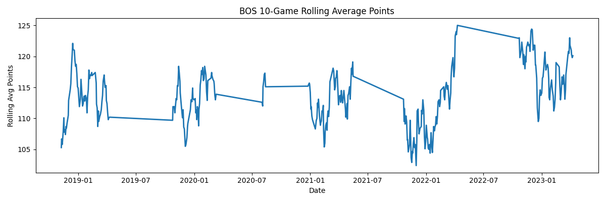
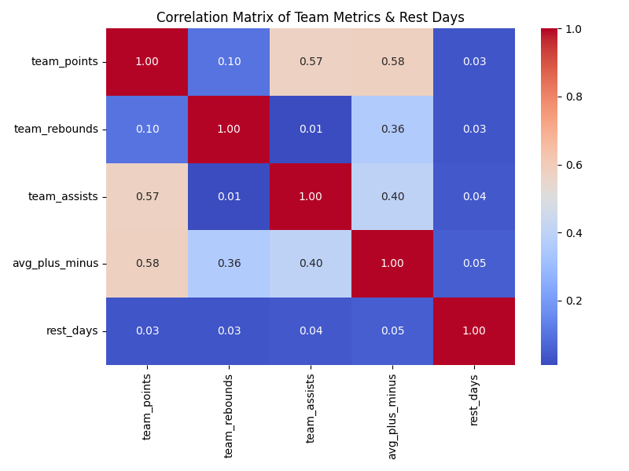
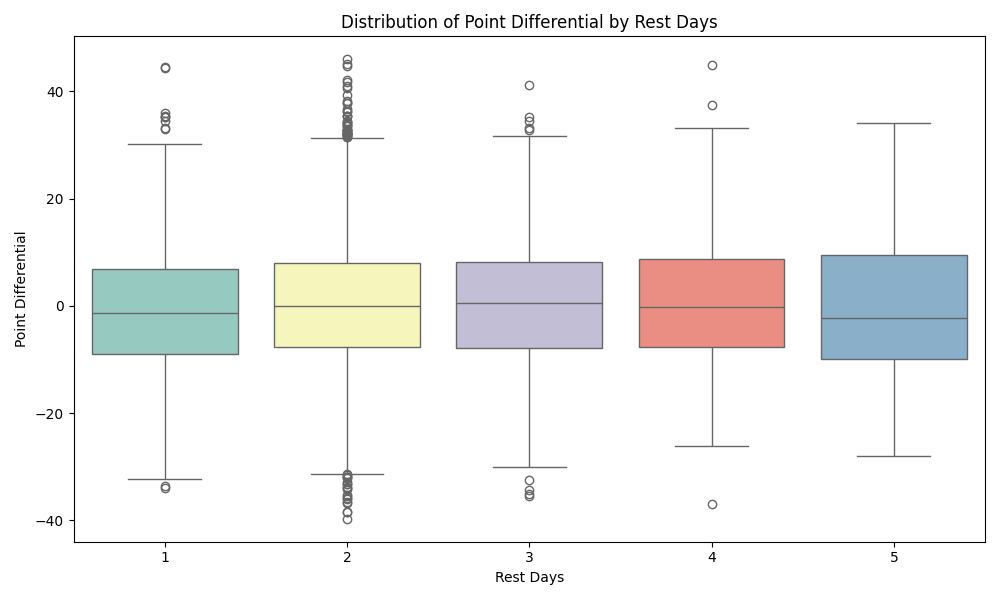
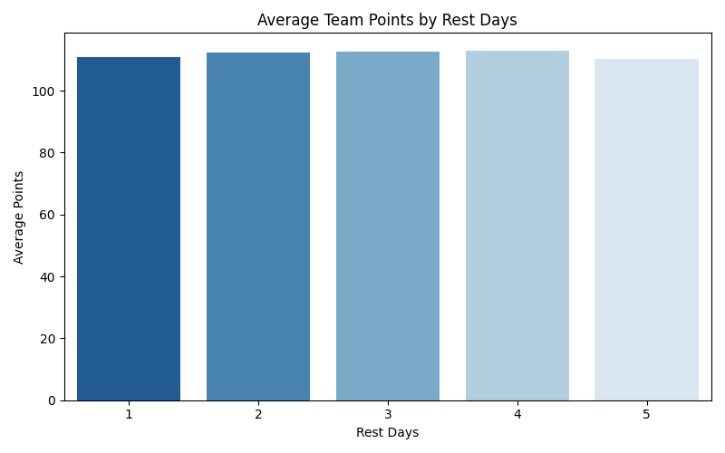
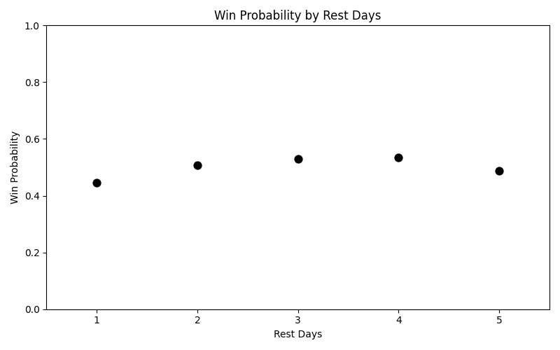

# ds3022-project3

Scripts should be run in this order:
1. nba_client.py
2. duckdb_con.py
3. data_ingest.py
4. transform.py
5. analysis.py

This will connect to the API, connect to the duckdb, ingest the data into duckdb, clean up the tables, and then perform analysis.

The purpose of this project is to look at 5 past seasons of NBA play to try and grasp how rest days affect team play/success. Teams were looked at overall throughout the 5 years. Some additional analysis was performed just for personal curiousity. I wanted to see what kinds of under or overperformances stuck out throuhgout the year. Also, I looked at the Boston Celtic's rolling average for points across the seasons. However, because of the amount of data the conclusions from this graph were pretty inconclusive. 

Plots:

